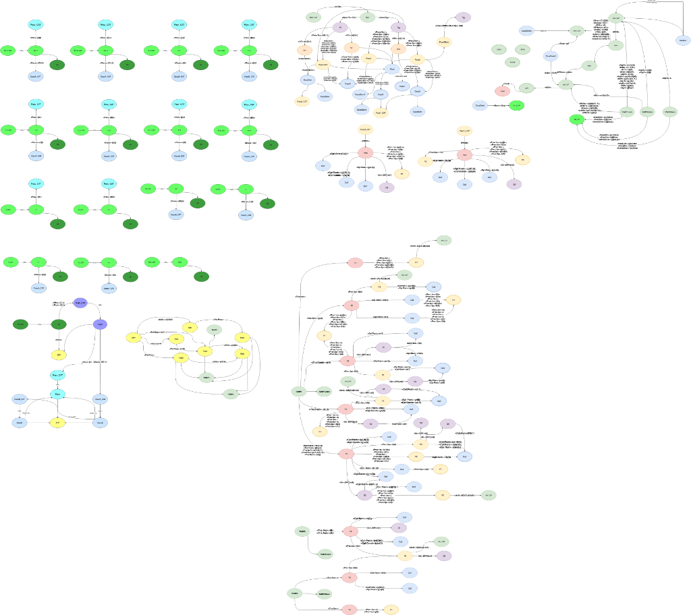

# Turkish Morphology FST (Türkçe Biçimbilgisi FST)

Türkiye Türkçesi'nin isim ve çekimli fiil biçimbilgisini sonlu durum transdüserleri (FST) kullanarak tanımlayan production-ready web servisi.

## 🎯 Proje Hakkında

Bu proje, Helsinki Finite-State Technology (HFST) çatısı üzerinde Türkçe morfolojik analiz ve üretim işlemleri için bir web servisi geliştirmeyi amaçlamaktadır.

### Temel Özellikler

- **Nominal Paradigm**: İsim çekimleri için yuvalı (slot-based) yaklaşım
- **Verbal Paradigm**: Fiil çekimleri için isteğe bağlı yollardan oluşan karma yaklaşım
- **REST API**: Morfolojik analiz ve üretim için web servisi
- **Modern Web UI**: Kullanıcı dostu arayüz

## 📊 FST Diyagramları

Projenin FST state diyagramları aşağıda görülebilir:



## 🏗️ Proje Yapısı

```
turkish-morphology-fst/
├── fst/                    # FST Core Module
│   ├── lexicon/           # Lexicon files (.lexc)
│   ├── rules/             # FST rules (.xfst)
│   └── compiled/          # Compiled .hfst files
├── backend/               # FastAPI Backend
├── frontend/              # Web Interface
└── docs/                  # Documentation
```

## 🚀 Hızlı Başlangıç

```bash
# Clone the repository
git clone https://github.com/YOUR_USERNAME/turkish-morphology-fst.git
cd turkish-morphology-fst

# Start with Docker
docker-compose up -d

# Or run locally
cd backend && pip install -r requirements.txt && uvicorn main:app --reload
```

## 📖 API Kullanımı

### Morfolojik Analiz

```bash
curl -X POST http://localhost:8000/api/analyze \
  -H "Content-Type: application/json" \
  -d '{"word": "evlerimizden"}'
```

### Morfolojik Üretim

```bash
curl -X POST http://localhost:8000/api/generate \
  -H "Content-Type: application/json" \
  -d '{"lemma": "ev", "tags": ["N", "Pl", "P1pl", "Abl"]}'
```

## 🛠️ Teknoloji Stack

- **FST Framework**: HFST (Helsinki Finite-State Technology)
- **Backend**: FastAPI (Python)
- **Frontend**: Next.js (React)
- **Containerization**: Docker

## 📅 Roadmap

- [x] Proje planlaması
- [ ] FST lexicon ve kuralları
- [ ] Backend API
- [ ] Frontend UI
- [ ] Production deployment

## 📄 Lisans

MIT License

## 👥 Contributors

- [Berke Hoca ile ortak proje]
